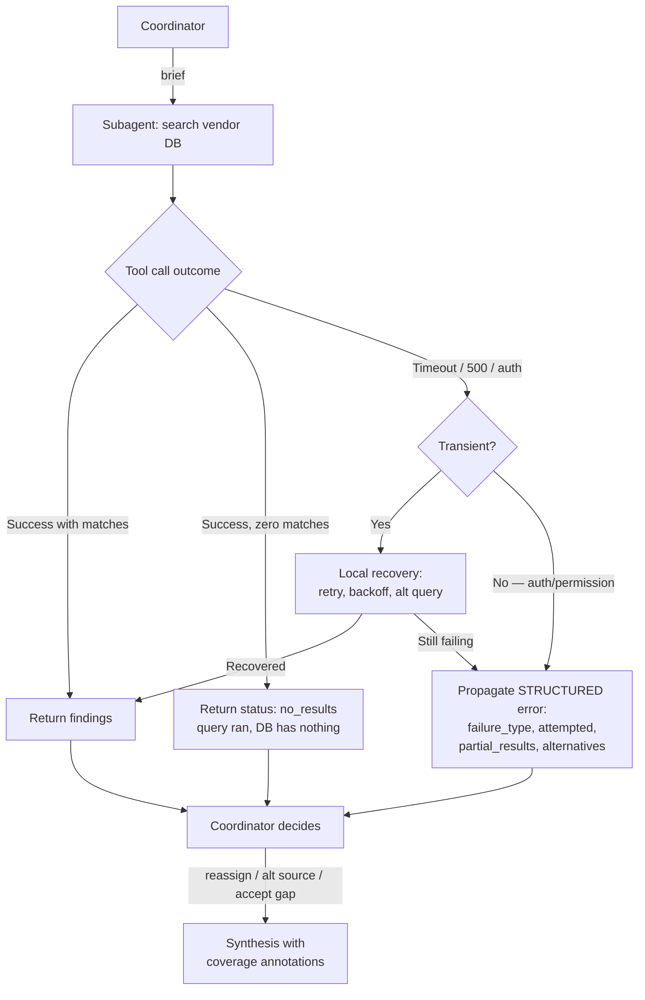
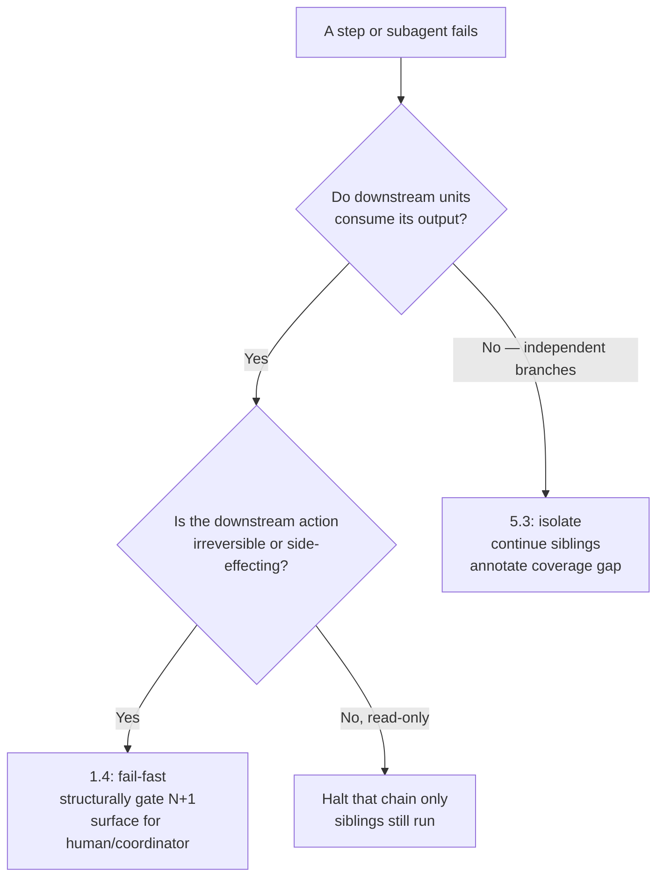

# Topic 5.3 — Implement error propagation strategies across multi-agent systems

**Domain:** 5 — Context Management & Reliability (15%)
**Topic number:** 5.3 (Topic 27 of 30 overall)

---

## 1. Mental model

**The topic in one line:** a subagent's error is *information for the coordinator's next decision* — so it must be structured, must distinguish "couldn't ask" from "asked and got nothing," and must never kill the run or vanish silently.

---

## 2. Core concepts

- **The coordinator is the recovery decision-maker.** It alone knows the other subagents, the remaining budget, and the overall goal. A subagent that decides "this run is over" is deciding above its pay grade.
- **Structured error context** = four fields: **failure type**, **what was attempted**, **partial results** already obtained, **alternative approaches**. Each field unlocks a different coordinator action.
- **Access failure ≠ empty result.**
  - *Access failure*: the query never really ran (timeout, 503, auth denied) → retry, reroute, or flag a gap.
  - *Valid empty result*: the query ran successfully and the corpus genuinely contains nothing → that is a **finding**, not an error.
- **Generic status strings destroy the coordinator's options.** `"search unavailable"` collapses timeout, rate-limit, bad credentials, and malformed query into one indistinguishable blob.
- **Partial results are still results.** A subagent that read 7 of 10 sources before failing must return the 7 — those tokens were already paid for.
- **Local recovery belongs at the subagent.** Transient failures (timeout, 429, one flaky endpoint) are handled in place so the coordinator's context is not spent on retry mechanics.
- **Coverage annotations** carry the failure through to the deliverable: synthesis states which conclusions are well-supported and which topic areas are thin **because a source was unreachable**.

---

## 3. Decision table

| Option | Use when | Breaks when | Why the exam favours it |
|---|---|---|---|
| **Structured error object** (type + attempted + partial + alternatives) | Any failure the subagent can't resolve locally | Never really — it's the default correct answer | Gives the coordinator enough to reroute, retry a variant, or accept a scoped gap |
| **Local retry inside the subagent** | Transient: timeout, 429, single flaky endpoint | Auth failure, permission denied, malformed schema — retrying repeats the same failure | Keeps recovery cheap and out of the coordinator's context |
| **Propagate to coordinator** | Non-transient, or local retries exhausted | Used for *everything*, including one-off blips → coordinator drowns in noise | Escalates only what needs cross-agent knowledge to fix |
| **Report `no_results` as success** | Query executed, source genuinely empty | Reported as an error → coordinator wastes retries on a working source | Distinguishes "no data exists" from "couldn't reach data" |
| **Generic error string** | Basically never | Always — the coordinator can't choose an action | Classic distractor: looks like clean abstraction, is information destruction |
| **Return empty + status success on failure** | Never | Always — the gap becomes invisible and the report silently under-covers | Silent suppression is the worst option in this domain |
| **Abort the whole workflow** | Only when the failure invalidates *every* remaining branch | One of eight independent searches fails → seven good results discarded | Fail-fast is right for ordered irreversible steps (1.4), wrong for independent parallel research |

**Decision boundary:** *can this subagent fix it alone?* → yes: fix locally, stay silent. No: return structure, let the coordinator choose. Never: swallow it, or end the run.

---

## 4. Worked mini-scenario — multi-agent research system

Coordinator spawns 5 subagents to research competitor pricing. Subagent 3 (industry-report database) hits repeated 504s after retrieving 2 of 6 reports.

- **Subagent 3 retries locally** with backoff; 504s persist → not resolvable in place.
- **It returns structure, not a string:** `failure_type: "source_timeout"`, `attempted: "query 'SaaS pricing benchmarks 2025' against ReportsDB, 3 attempts"`, `partial_results: [2 report summaries]`, `alternatives: "vendor pricing pages; analyst blog mirrors"`.
- **Coordinator acts on the fields:** keeps the 2 partial reports, re-tasks a free subagent onto the suggested alternative, and does **not** cancel subagents 1, 2, 4, 5.
- **Subagent 4 returns zero matches** from the patent database — the query executed fine. It reports `status: no_results`, **not** an error → recorded as a genuine finding, no retry.
- **Synthesis carries coverage annotations:** "Pricing tiers: well-supported (4 sources). Enterprise discounting: **limited coverage — ReportsDB unreachable, 2 of 6 reports retrieved.**"

---

## 5. Anti-patterns

| ❌ Anti-pattern | ✅ Correct | Why it's wrong |
|---|---|---|
| Subagent catches the error, returns `{results: [], status: "ok"}` | Return explicit failure status with context | The gap becomes undetectable — the report understates coverage and no one knows why |
| Subagent returns `"Error: search unavailable"` | Return typed failure + attempted query + alternatives | Coordinator can't tell retry-worthy from hopeless; it guesses |
| Any subagent failure terminates the whole workflow | Isolate the failure, continue independent branches | Discards completed work from unrelated agents |
| Coordinator handles every retry itself | Subagent retries transients locally; propagates only what it can't fix | Fills coordinator context with retry mechanics instead of findings; re-spawn loses in-progress work |
| Zero-match search reported as an error | Report as `no_results` success | Triggers pointless retries against a healthy source and hides a real negative finding |
| Failed subagent discards its partial results | Include `partial_results` in the error payload | Throws away tokens already spent and evidence already gathered |
| Synthesis reads identically whether all sources worked or half failed | Annotate coverage per topic area | Reader can't distinguish "no evidence exists" from "we couldn't look" |
| Error details relegated to a report appendix | Annotate adjacent to the affected claim | Reader has no cue to correlate an appendix entry with a specific conclusion |

---

## 6. Exam cheat-sheet

| Trigger phrase in the question | Correct answer pattern |
|---|---|
| "subagent's search timed out — what should it return?" | Structured error: failure type, attempted query, partial results, alternatives |
| "coordinator can't tell why the search failed" | Replace the generic status string with typed structured error context |
| "search returned no matching documents" | Valid empty result → report as success/`no_results`, not an error |
| "one subagent failed; what happens to the others?" | Isolate — continue independent branches, never terminate the workflow |
| "transient timeout / rate limit" | Local recovery in the subagent first; propagate only if unresolved |
| "auth failure / permission denied" | Propagate immediately — retrying repeats the same failure |
| "final report doesn't reveal which topics were under-researched" | Coverage annotations in synthesis output |
| "agent returned empty results and marked it successful" | Silent suppression anti-pattern — the *worst* option on offer |
| "subagent got 7 of 10 sources then failed" | Return the 7 as `partial_results` alongside the error |
| Options split between "retry" / "abort" / "structured context" | Structured context wins — it lets the coordinator *choose* retry or abort |
| "coordinator handled the error correctly but harm still occurred" | The gap is downstream — fix the synthesis output, not the coordinator |

---

## 7. Clarification raised in session — how 5.3 differs from fail-fast in 1.4

The two topics answer **different questions about the same failure**.

| | Topic 1.4 (fail-fast) | Topic 5.3 (isolate & degrade) |
|---|---|---|
| Question answered | *May the next step run?* | *What does the failing unit tell the coordinator?* |
| Structure assumed | Sequential, **dependent** steps | Parallel, **independent** branches |
| Failure of step/agent N | Invalidates N+1 — its inputs don't exist | Invalidates only its own branch |
| Correct response | **Halt before N+1** | **Continue the siblings**, mark a coverage gap |
| What "wrong" looks like | Proceeding on unverified state (refund issued before eligibility check) | Killing 7 healthy searches because 1 timed out |
| Enforcement site | Structural gate in the harness, not a prompt | Coordinator's routing decision, informed by the error payload |

### The axis that decides it: dependency, not severity

The exam gives you the **topology**, never the label:
- "eligibility check → approval → **issue refund**" — one chain, irreversible tail → **fail-fast**.
- "five subagents each research a different competitor" — fan-out, no consumer → **isolate and degrade**.

**Severity is the trap.** A dramatic failure in an independent branch still doesn't justify aborting; a mundane failure upstream of an irreversible write absolutely does.

### What the two topics share

| Shared rule | In 1.4 | In 5.3 |
|---|---|---|
| Never silently suppress | Can't mark an unverified step "verified" to keep the chain moving | Can't return `{results: [], status: ok}` |
| Return structured context, not prose | Handoff carries structured state, not transcript text | Failure carries type/attempted/partial/alternatives |
| Preserve partial work | Completed prior steps stay valid and recorded | Partial results ride inside the error payload |
| The failing unit doesn't decide the run's fate | The gate decides; the step reports | The coordinator decides; the subagent reports |

**Fail-fast is not "return less."** Even when halting, the full structured error is still emitted — you simply don't let step N+1 execute. Fail-fast constrains *continuation*; 5.3 constrains *reporting*. They are orthogonal, so one question can require both.

### The mixed case

A coordinator fans out 5 subagents, then feeds findings into a synthesis step writing a shared report.
- Subagent 3 fails → **5.3 on the fan-out**: 1, 2, 4, 5 continue; 3 returns structured error + partials.
- Synthesis still runs — with **coverage annotations**, since its inputs are legitimately incomplete and it is read-only.
- Change the tail to "auto-publish to customers" → irreversible side-effecting consumer, so publication is gated on coverage or routed to human review: **1.4 logic on the tail, 5.3 logic on the branches.**

---

## 8. Practice questions

### Question 1 — valid empty result vs access failure

A multi-agent research system uses a coordinator that spawns six subagents, each querying a different data source about a target company. Subagent 4 queries an internal analyst-report database. The query executes successfully in 1.2 seconds and the database returns zero matching documents.

The subagent is currently coded to return `{"status": "error", "message": "search unavailable"}` whenever it has no documents to hand back.

The coordinator responds by re-spawning subagent 4 twice more against the same source, consuming budget, before giving up and omitting the topic from the final report entirely.

What is the most effective fix?

**A.** Increase the coordinator's retry limit for subagent failures and add exponential backoff, so transient database issues have more time to resolve before the topic is dropped.
**B.** Have the subagent distinguish access failures from valid empty results, returning a successful `no_results` status when a query executes but matches nothing, so the coordinator records it as a finding rather than retrying.
**C.** Have the subagent return `{"status": "ok", "results": []}` for both empty results and failed queries, so the coordinator never wastes retries and the workflow always completes.
**D.** Configure the coordinator to terminate the entire research workflow when any subagent reports an error, preventing wasted budget on retries against unavailable sources.

**Correct answer: B**

**Why B is right.** The root cause is a **category error inside the subagent**: a query that ran successfully and found nothing is a *finding*, not a failure. Collapsing both into `"search unavailable"` makes the coordinator unable to tell "the source is down" from "the source is healthy and genuinely has no analyst coverage." Once the subagent reports `no_results` as a success, two things fix themselves: the coordinator stops burning budget retrying a working source, and "no analyst reports exist" survives into the report as a substantive negative finding instead of vanishing as an omitted topic.

**Why A is wrong.** Tunes the symptom and preserves the bug. More retries against a functioning source multiplies the waste. Backoff is correct for a *genuine* transient access failure, but the query executed cleanly in 1.2 seconds. Retry policy can never repair a misclassification.

**Why C is wrong.** Silent suppression — the worst option on offer. It stops the retries (the tempting part) by making real access failures indistinguishable from empty ones. A database outage would report `status: ok, results: []`, the coordinator would see no gap, and the report would confidently under-cover a topic with no trace of why.

**Why D is wrong.** Wrong continuation policy for this topology. Six independent branches; one failure doesn't invalidate the other five, and aborting discards valid completed work. Whole-workflow termination is 1.4 logic for dependent irreversible chains — and here it wouldn't even be triggered by a real error, only by a misreported empty result.

---

### Question 2 — generic string vs structured error context

A multi-agent competitive-intelligence system runs eight subagents in parallel. Subagent 6 retrieves pricing pages from a vendor portal. It successfully retrieves and summarizes 7 of 10 target pages, then the portal begins returning HTTP 504s. The subagent retries three times with backoff; the 504s persist.

The subagent returns a single string to the coordinator: `"Portal retrieval failed after retries."` The coordinator marks the pricing topic unavailable and moves to synthesis. The final report contains no vendor pricing data at all.

Which change most improves the coordinator's ability to recover?

**A.** Move retry logic out of the subagent and into the coordinator, so the coordinator controls the backoff schedule and can decide how many attempts each source deserves before declaring it unavailable.
**B.** Have the subagent return structured error context — failure type, the pages attempted, the 7 summaries already obtained, and suggested alternative sources — instead of a summary string.
**C.** Have the subagent continue retrying the remaining 3 pages indefinitely with a longer backoff, since partial data is misleading and the report should either cover all 10 pages or none.
**D.** Have the coordinator re-spawn subagent 6 with an identical brief after a fixed delay, since a fresh subagent instance will retry the portal from a clean state.

**Correct answer: B**

**Why B is right.** Two losses are happening and only B fixes both. First, **7 already-paid-for summaries are discarded** — nothing about a 504 on pages 8–10 invalidates pages 1–7. Second, the generic string tells the coordinator that something broke but not *what kind*, so it cannot choose between rerouting, accepting a scoped gap, or trying later. The structured payload restores the four fields the coordinator needs: `failure_type: gateway_timeout` (transient, source-side — worth an alternative route, not an auth problem), `attempted` (so it isn't repeated identically), `partial_results` (7 summaries salvaged), `alternatives` (a concrete next action the subagent is best positioned to suggest). Crucially, B does not decide the run's fate — the subagent reports, the coordinator chooses.

**Why A is wrong.** Moves recovery to the wrong layer. Transient failures are exactly what a subagent should absorb locally, and it already did the right thing with three backed-off retries. Hoisting retry mechanics into the coordinator fills its context with attempt-level bookkeeping for eight subagents, and still leaves the defect untouched — a coordinator running the retries would *still* have no partial results and no failure type when it gave up.

**Why C is wrong.** All-or-nothing coverage plus an unbounded loop. Indefinite retry against persistent 504s spends budget on a failure mode local recovery already ruled out. "Partial data is misleading" is the actual error: partial data isn't misleading when it's **annotated** — 7 of 10 clearly marked is far more useful than an empty section.

**Why D is wrong.** Repeats the identical failure and re-loses the partials. A fresh instance has no memory of the 7 pages already summarized, so it re-fetches from scratch against a portal still timing out. Re-spawning is defensible only when structured context tells the coordinator something has changed — which is exactly what B supplies.

---

### Question 3 — local recovery vs immediate propagation

An engineering team runs a multi-agent codebase-audit system: a coordinator spawns nine subagents, each auditing a different service repository.

Current behavior:
- Subagent 2 hits a one-off socket timeout on a repo clone. It immediately returns an error to the coordinator, which re-spawns it; the second attempt succeeds.
- Subagent 5 receives `403 Forbidden` from the artifact registry — its service account lacks read access. It retries locally eight times with exponential backoff over four minutes, then returns an error.

Across a full run, the coordinator's context fills with transient-failure chatter, and wall-clock time is dominated by subagent 5's backoff.

Which design change best addresses both problems?

**A.** Standardize on a single policy: every subagent retries all failures locally up to eight times with backoff, and propagates only if all attempts fail — giving consistent, predictable behavior across all nine subagents.
**B.** Standardize on a single policy: every subagent propagates all failures to the coordinator immediately without local retries, centralizing all recovery decisions in the one component that has full system visibility.
**C.** Have subagents implement local recovery for transient failures only, and propagate non-transient failures immediately with structured context describing what was attempted and any partial results.
**D.** Have the coordinator classify each incoming error and decide retry policy per failure type, while subagents continue to propagate every failure immediately as they do today.

**Correct answer: C**

**Why C is right.** The scenario contains **one failure of each kind**, and any uniform policy gets one wrong. The socket timeout is **transient** — the identical retry has a real chance of succeeding (and did) — so it belongs to local recovery, absorbed in place, never reaching the coordinator's context. The `403 Forbidden` is **non-transient**: permissions will not change during a four-minute backoff, so all eight attempts are guaranteed to reproduce the same failure. It should propagate on the *first* response with structured context so the coordinator can reroute, request a credential grant, or record a scoped audit gap. The boundary is **"can retrying the same call plausibly succeed?"** — not "how many times should we try?"

**Why A is wrong.** Uniform retry fixes the coordinator chatter but makes subagent 5 far worse: eight guaranteed-identical failures against a permission wall, with wall clock hostage to backoff on an unfixable error. Consistency is not a virtue when failure classes genuinely differ.

**Why B is wrong.** The mirror-image error. It ends the wasted backoff, but every transient blip across nine subagents now lands in the coordinator's context, and each recovery costs a full **re-spawn** that discards whatever the original had already audited. Local recovery exists because a subagent can retry a call far more cheaply than a coordinator can rebuild the agent that made it.

**Why D is wrong (closest distractor).** Classifying failure types is correct, but D puts the classifier in the wrong place *and* leaves subagent behavior unchanged. Subagents still propagate everything, so the coordinator's context still fills with transient chatter — problem one survives. And coordinator-driven retry is still re-spawn-driven retry, so in-progress work is still lost. Classification must happen **where the failure occurs**, so transients are resolved before consuming coordinator context.

---

### Question 4 — coverage annotations in synthesis

A market-research multi-agent system produces a synthesized report for internal decision-makers. On one run, three of eleven source subagents failed with structured errors (two source outages, one permission block), and the coordinator correctly isolated them, continued the remaining eight, and passed all available findings to synthesis.

The synthesis agent produced a fluent, confident report. Two weeks later, a product team makes a pricing decision citing the report's claim that "no evidence of enterprise-tier discounting was found among competitors" — a conclusion resting entirely on the eight sources that *did* respond. The two unreachable sources were the industry-contract databases most likely to contain that evidence.

The coordinator's error handling worked exactly as designed. What is the most effective fix?

**A.** Configure the coordinator to abort the run and produce no report whenever any source subagent fails, ensuring decision-makers never act on partial evidence.
**B.** Have the coordinator retry failed subagents until every one of the eleven sources returns successfully, so every report is based on complete coverage.
**C.** Require the synthesis agent to structure its output with coverage annotations, marking which findings are well-supported and which topic areas have gaps because sources were unavailable.
**D.** Append the coordinator's raw structured error objects to the end of the report as an appendix, so readers can inspect exactly which subagents failed and why.

**Correct answer: C**

**Why C is right.** Error propagation isn't finished when the coordinator handles the failure correctly — it's finished when the failure reaches the **consumer of the output**. The coordinator did everything right and harm still occurred because the information died at the synthesis boundary. A fluent report renders two very different states identically: "we searched and found no discounting evidence" (a genuine negative finding) versus "we couldn't reach the contract databases, so absence of evidence means nothing." Coverage annotations force synthesis to distinguish them **per topic area** — the right granularity, because the problem isn't that the report is 73% covered overall, it's that *this specific claim* rests on sources that systematically exclude where the evidence would live.

**Why A is wrong.** All-or-nothing coverage — the workflow-termination anti-pattern dressed as caution. Eight sources of valid, expensively-gathered research get discarded because three failed, and a system this brittle produces no report on most real runs. Partial evidence isn't dangerous; *unlabeled* partial evidence is.

**Why B is wrong.** Unbounded retry against sources that failed for reasons retrying cannot fix. One was a **permission block**, which returns 403 on attempt one and attempt five hundred. This guarantees an infinite loop or a silent give-up, and treats complete coverage as always achievable.

**Why D is wrong (closest distractor).** It's the only wrong answer that preserves the information, which is why it tempts — but it puts it in the wrong **place and form**. An appendix of raw error objects is disconnected from the claims it undermines: a reader meeting "no evidence of enterprise-tier discounting" in the body has no cue to flip to an appendix, and no way to map `failure_type: permission_denied, source: ContractsDB` onto that sentence. Annotations work because they sit **adjacent to the affected conclusion**. Transparency that requires the reader to do the correlation isn't transparency.

---

**Session result: 4/4 correct.**
