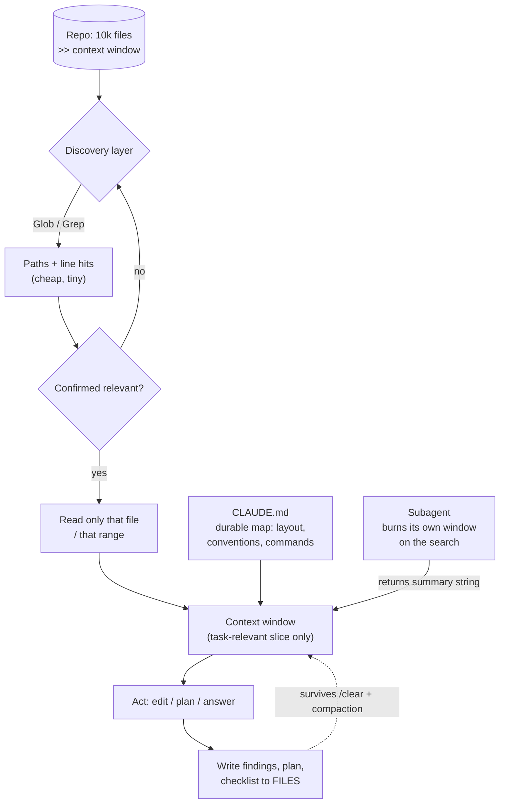
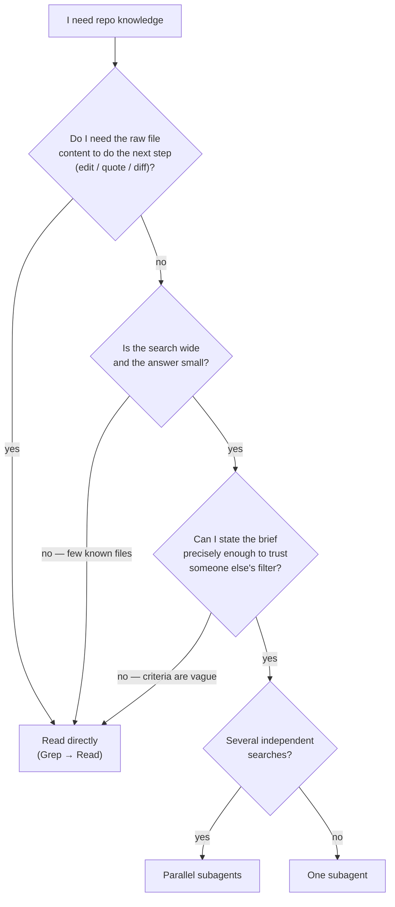

# 5.4 — Context Management in Large Codebases

- **Domain:** 5 — Context Management & Reliability (15% of exam)
- **Topic:** 5.4 (topic 28 of 30 overall)
- **Exam scope:** How to give Claude enough of a repo to act correctly without exceeding or polluting the context window — retrieval strategy, delegation, persistent maps, and external memory.

---

## 1. Mental model

**The one sentence:** in a large codebase you never load the codebase — you run a **cheap identifier-level search** to find the small slice that matters, and you push everything else into **files, subagents, or CLAUDE.md**.

---

## 2. Core concepts

- **Context is a budget, not a container.** The skill tested is *selection*, not *capacity* — "the window is bigger now" is never the exam's answer.
- **Agentic search beats a pre-built index.** Claude Code searches the live filesystem (`Glob` → `Grep` → `Read`) at query time, so results match the repo's current state; a vector index goes stale the moment someone commits.
- **Two-phase retrieval.** Phase 1 returns **paths and matching lines** (tiny). Phase 2 reads **only confirmed files**, and only the needed range. Never invert the order.
- **CLAUDE.md is the map, not the territory.** It holds *pointers* — where auth lives, naming conventions, build/test commands — because it loads into **every** session. Putting file contents in it spends the budget permanently.
- **Path-specific rules scope conventions by file kind.** `.claude/rules/*.md` with glob frontmatter (D3.3) loads a convention only when a matching file is touched, instead of paying for it always.
- **Subagent = context firewall.** The exploration transcript stays in the subagent's window; only the returned **string** crosses back (D1.2 / D1.3). Use it when the *search* is large but the *answer* is small.
- **Filesystem = external memory.** Plans, migration checklists, per-file findings written to disk survive `/clear`, compaction, and session boundaries (D5.1).
- **Scope the unit of work to a module.** A task that cannot be stated without 50 files open is a **decomposition** problem (D1.6), not a context problem.

---

## 3. Decision table — how to get repo knowledge into context

| Option | Use when | Breaks when | Why the exam favours it |
|---|---|---|---|
| **Glob/Grep → targeted `Read`** | Default for any "where/how is X done" question | Concept has no searchable token (pure semantics) | Cheapest correct path; ground truth is the current repo |
| **Read whole file(s)** | You already confirmed relevance; file is the unit of edit | Applied speculatively across a directory | Correct *after* discovery, catastrophic *as* discovery |
| **Delegate exploration to a subagent** | Open-ended search over many files; answer is a short summary or a path list | You need the raw code back to edit it — you'd just re-read it | Keeps the coordinator's window clean; cost is paid in an isolated window |
| **CLAUDE.md pointers** | Stable structural facts reused every session (layout, commands, conventions) | Volatile detail — it goes stale and misleads silently | Removes rediscovery cost from every future session |
| **Path-scoped rules (glob frontmatter)** | Convention applies to one file kind only | Used for repo-wide facts (belongs in CLAUDE.md) | Pays context cost only when relevant |
| **Write findings/plan to a file** | Multi-file or multi-session work | Task fits in one pass — pure overhead | Survives compaction; the exam's answer to "lost context mid-refactor" |
| **`/clear` between unrelated tasks** | New task shares nothing with the old one | Mid-task — you destroy needed state | Prevents stale context from steering the next task |
| **`/compact`** | One long task must continue past the window | Treated as lossless — details *are* dropped | Continuity tool, not a memory guarantee |
| **Prompt caching over a stable file set** | Same large context reused across many calls | Files change between calls (cache misses) | **Cost/latency** lever only — never a capacity lever |

---

## 4. Worked mini-scenario — monorepo API rename

**Context:** 4,000-file monorepo. Rename `getUserProfile()` → `fetchUserProfile()` across all call sites, updating tests and docs.

- ❌ **Wrong first move:** read `src/` to "understand the codebase" — the window fills before a single edit.
- ✅ **Discovery:** `Grep "getUserProfile"` → 63 hits across 41 files. Cost: a page of text, not a repo.
- ✅ **Externalize:** write the 41 paths to `refactor-checklist.md` **before** editing — this is now the source of truth if context resets.
- ✅ **Execute per file:** read → edit → tick the checklist. Each file enters and leaves the working set; no accumulation.
- ✅ **Verify:** re-run `Grep "getUserProfile"` → expect zero hits. Verification is another cheap search, not a re-read.
- ✅ **Cross-check the ambiguous ones** (a doc snippet, a string in a test fixture) — flagged in the checklist, decided once.

**Why it passes:** peak context ≈ one file, and progress lives on disk, so a compaction or `/clear` at file 30 costs nothing.

---

## 5. Anti-patterns

| ❌ Anti-pattern | ✅ Instead | Why it's wrong |
|---|---|---|
| Load the whole repo/directory "for context" | Search first, read confirmed hits only | Fills the window with irrelevance; degrades attention on what matters |
| Paste large file contents into CLAUDE.md | Put a **pointer** in CLAUDE.md, read the file on demand | CLAUDE.md loads every session — a permanent tax, and it goes stale |
| Build a vector index of the repo and query that | Grep/Glob the live filesystem | Index drifts from HEAD; exact-symbol search is more precise than embedding similarity for code |
| Spawn a subagent to "go read these 5 files and send them back" | Read them directly | The content re-enters your window anyway, plus you paid for a round trip |
| Rely on `/compact` to remember the migration list | Write the list to a file | Compaction summarizes lossily; a 41-item list becomes "several files" |
| Keep one giant session for the whole refactor | One scoped task per session, state on disk | Old irrelevant context outweighs new relevant context |
| Re-`Read` a file you just edited to confirm | Trust the edit; verify by targeted search/test | Doubles context cost for zero information |
| Ask Claude to "find everything related to auth" with no scope | Name the concrete symbol, path prefix, or file glob | Unbounded search produces unbounded context |

---

## 6. Exam cheat-sheet

| Trigger phrase in the question | Correct answer pattern |
|---|---|
| "Large monorepo, agent runs out of context" | **Search-then-read**; scope the task; externalize state to files |
| "Which is the most efficient way to locate…" | `Grep`/`Glob` for the symbol → read only matching files |
| "Should we build a vector/embedding index?" | **No** — agentic search on the live filesystem; index goes stale |
| "Exploration is broad but the answer is short" | **Delegate to a subagent**; only the summary returns |
| "Context lost mid-refactor / after compaction" | State should have been written to a **file** (checklist/plan) |
| "Team keeps re-explaining the repo layout each session" | **CLAUDE.md** with structural pointers and commands |
| "Convention applies only to `*.test.ts` / `api/**`" | **Path-specific rule** with glob frontmatter, not CLAUDE.md |
| "Reduce cost of repeatedly sending the same large context" | **Prompt caching** — cost lever, does *not* raise capacity |
| "Starting an unrelated task in the same session" | `/clear` |
| "Task genuinely can't fit even when scoped" | **Decompose** into independently verifiable units (D1.6) |
| "How do we verify the refactor is complete?" | Re-run the **search**; zero hits + tests, not a re-read |

---

## 7. Clarification: the subagent-vs-direct-read boundary

**The boundary in one line:** a subagent is a **lossy compressor with a string-only return channel**. Delegate when the thing you want back is *smaller* than the thing that must be read to find it. Read directly when you need the **raw bytes to act on**.

### The four tests

| Test | Question | Delegate if… | Read directly if… |
|---|---|---|---|
| **Compression** | Does the answer compress relative to what must be read? | 40 files read → 10-line answer | 3 files read → 3 files needed |
| **Actionability** | Do I need the literal text to take the next action? | No — I need a verdict, a path list, a summary | **Yes** — I'm going to edit/quote it |
| **Specifiability** | Can I write a brief whose filter I'd trust unseen? | Criteria are concrete ("find every caller of `X`") | Criteria are fuzzy ("find anything that looks risky") |
| **Parallelism** | Are there ≥2 independent searches? | Yes — fan out, latency collapses | One thread of investigation |

**Actionability is the dominant test.** If you need the content, delegation costs you **twice**: the subagent's tokens *plus* your own re-read, because a subagent returns **only a string** — it cannot hand back its context window.

### Worked verdicts

| Situation | Verdict | Why |
|---|---|---|
| "Which files call `getUserProfile`?" | **Either** — but `Grep` is cheaper | Search already returns a compressed answer; a subagent adds a round trip for nothing |
| "How does auth work across these 6 services?" | **Subagent** | Wide read, narrow answer (a paragraph), no raw text needed |
| "Rename `getUserProfile` in all 41 files" | **Direct** (or one subagent *per file* that edits) | You need the bytes; a summary can't be edited |
| "Is this bug present in the payments module too?" | **Subagent** | Yes/no + evidence line compresses hugely |
| "Read these 5 known files and give them to me" | **Direct** | Compression ratio ≈ 1; delegation is pure overhead |
| "Audit the repo for hardcoded secrets" | **Parallel subagents** by directory | Independent, wide, findings are short |
| "Find whatever seems off in this service" | **Direct** | Fails the specifiability test — you'd be trusting an unstated filter |
| "Where should a new endpoint live?" | **Subagent** | Answer is one path + a convention note |

### Delegation anti-patterns

| ❌ Anti-pattern | ✅ Instead | Why it's wrong |
|---|---|---|
| Subagent fetches files so you can edit them | Read directly | String-only return; content re-enters your window anyway — **paid twice** |
| Subagent with a vague brief ("look around and report") | Concrete brief + explicit output contract | You cannot audit what it *chose not to* report; silent omissions look like clean results |
| Trusting a subagent's "I found nothing" | Verify absence with your own `Grep` | **Negative results are the weakest subagent output** — absence of evidence in a summary ≠ absence in the repo |
| Delegating a search you could `Grep` in one call | `Grep` | Grep already compresses; the subagent adds latency and a summarization step that can lose hits |
| Subagent hits ambiguity mid-search | Resolve ambiguity in the brief up front | A subagent can't come back to ask you (D5.2) — it guesses, and the guess is invisible |

### The distractor this rules out

The plausible-but-wrong option is **"delegate exploration to a subagent to save context"**, offered whenever the scenario says *large codebase*. It is wrong whenever the coordinator's next action needs the file content, because the saving is illusory: you spend the subagent's window **and** your own.

The mirror distractor is **"read the files directly to avoid summarization loss"** on a question whose deliverable is a 10-line architectural summary. There, fidelity to raw text buys nothing and blows the window.

**The discriminator is never "is the repo big?" — it's "what shape is the thing I need back?"**

---

## 8. The three memory tiers (from Q3)

| Tier | Holds | Loads |
|---|---|---|
| **CLAUDE.md** | Stable pointers, conventions, commands | Every session — so keep it small |
| **`.claude/rules/` + glob** | Conventions scoped to a file kind | Only when a matching file is touched |
| **The files themselves** | All actual content | On demand, at HEAD |

**Content that lives in the repo should be referenced, never transcribed.**

---

# Practice questions

## Q1 — First step in a 6,000-file monorepo

A platform team runs a Claude Code agent inside a 6,000-file monorepo. A developer asks: *"Our checkout flow started double-charging customers when a retry fires. Find where the retry logic for payments lives and fix it."*

**Which first step is most effective?**

- **A.** Read the contents of the `src/payments/` directory in full so the agent has complete knowledge of the payment subsystem before reasoning about retries.
- **B.** Spawn a subagent with the brief *"read every file under `src/payments/` and return their contents"*, so the exploration cost is paid in the subagent's context window rather than the coordinator's.
- **C.** Run a `Grep` for retry-related symbols (e.g. `retry`, `idempotenc`, `attempt`) scoped to the repo, then read only the files whose matches look like payment retry logic.
- **D.** Build an embedding index of the monorepo and semantically query it for "payment retry logic", so future questions about the codebase are also answered cheaply.

### ✅ Correct answer: C

**Why C is right**

| Property | How C satisfies it |
|---|---|
| **Narrow before you read** | `Grep` returns paths + matching lines — a page of text, not a subsystem |
| **Ground truth** | Searches the live filesystem, so results match HEAD exactly |
| **Actionability** | The agent must *edit* the retry code, so the raw bytes have to end up in **its own** window |
| **Iterable** | If the symbol guesses miss, refine the pattern for near-zero cost — no sunk context |

The task is a **fix**, not a summary. That single fact settles the subagent question before repo size is even considered.

**Why the others are wrong**

| Option | Failure |
|---|---|
| **A** | Reading *as* discovery instead of *after* it. In a 6,000-file monorepo that directory may be hundreds of files; the window fills with irrelevant code (fees, refunds, ledger) and attention on the actual retry path degrades. "Complete knowledge before reasoning" is the exam's classic wrong instinct. |
| **B** | Fails the **actionability test**. A subagent's return channel is a **string** — it cannot hand back its context window. The contents re-enter the coordinator's window anyway, so you pay the subagent's tokens *plus* your own read, and add a round trip. |
| **D** | Two defects: the index goes **stale** on the next commit, and semantic similarity is weaker than exact-symbol search for code. It also solves a problem nobody asked about at the cost of the one that was asked. |

**Discriminator:** B is the trap — it uses the correct vocabulary ("exploration cost paid in the subagent's window") and that reasoning is right in *other* scenarios. It fails here only because the deliverable is code to be modified. Had the question asked *"summarize how retries work across our services,"* B's shape would have been correct.

---

## Q2 — Migration lost across a compaction

An engineer runs a Claude Code session to migrate a deprecated logging call across a large service. The agent identifies 58 affected files and begins editing them one by one, ticking them off in its reasoning. Around file 34 the conversation reaches the context limit and auto-compacts. After compaction the agent reports the migration as complete; review finds **11 files still using the deprecated call**.

**What should have been done differently?**

- **A.** Disable auto-compaction for the session so the full transcript is retained and no edit history is lost.
- **B.** Write the list of 58 affected files to a checklist file on disk before editing, and update it after each file.
- **C.** Delegate the migration to a subagent, so the 58 edits are performed in an isolated context window that does not compact.
- **D.** Run `/clear` before starting the migration so the full context window is available for the 58 files.

### ✅ Correct answer: B

**Why B is right**

| Property | How B satisfies it |
|---|---|
| **Durability** | A file lives outside the context window, so compaction, `/clear`, and session death cannot touch it |
| **Failure shape** | Progress state becomes *readable*, not *remembered* |
| **Resumability** | After compaction the agent reads 47 ticked / 11 unticked and continues exactly where it stopped |
| **Verifiability** | The checklist is auditable by a human, and completion is checkable by re-`Grep` |

The root cause is not that the window filled — that was always going to happen with 58 files. The root cause is that **progress state lived only in the transcript**, which is exactly what compaction is licensed to summarize away. A 58-item tick-list compresses to "migrated several files," and the loss is silent.

**Why the others are wrong**

| Option | Failure |
|---|---|
| **A** | Converts a lossy failure into a hard one — without compaction the session stops at the limit. Treats context as a capacity problem when it is a **persistence** problem. |
| **C** | A subagent has its own window, not an *unlimited* one — same wall, same lossy result, and now the coordinator can't see progress either. Also fails actionability: 58 edits, string-only return. (A *per-file* subagent would be defensible; that is not what C offers.) |
| **D** | Buys one-time headroom. Delays the limit, doesn't remove it, and does nothing to make progress survive the compaction that still arrives around file 40. |

**Discriminator:** A, C and D all try to make the window **big enough**. B accepts that it isn't and moves state **out of the window**.

---

## Q3 — Bloated, stale CLAUDE.md  ⚠️ *(missed on first attempt — answered D)*

A large monorepo has a 900-line root `CLAUDE.md` containing: the package layout and build/test commands; a **pasted copy** of the public API schema (~400 lines); and a long section on **test-file conventions** applying only to `**/*.test.ts`. Engineers report a large fixed context cost each session, and Claude has twice generated code against an API field **renamed three weeks ago**.

**Which change most effectively addresses both problems?**

- **A.** Split the root `CLAUDE.md` into per-package `CLAUDE.md` files placed in each package directory, so each session loads only the memory files on the path to the working directory.
- **B.** Replace the pasted API schema with a pointer to the schema file, and move the test conventions into a `.claude/rules/` file with glob frontmatter matching `**/*.test.ts`.
- **C.** Remove `CLAUDE.md` entirely and rely on agentic search, so Claude discovers the layout, schema, and conventions from the live filesystem on each task.
- **D.** Keep the content in `CLAUDE.md` but enable prompt caching for the session, so the fixed 900-line prefix is cached and no longer costs full price on each request.

### ✅ Correct answer: B

**Why B is right** — it fixes each symptom at its cause:

| Symptom | Cause | B's fix |
|---|---|---|
| Stale API field | The schema was **copied** into CLAUDE.md — a second source of truth that drifts | Replace with a **pointer**; Claude reads the actual schema file on demand, always at HEAD |
| Fixed per-session cost | ~400 lines of schema + test conventions load in **every** session regardless of relevance | Schema loads only when needed; test conventions load only when a `**/*.test.ts` file is touched (D3.3) |

**Why the others are wrong**

| Option | Failure |
|---|---|
| **A** | The mechanism is real (memory files merge additively down the path, D3.1) and is reasonable monorepo practice — but it addresses **neither** symptom. The pasted schema is still pasted, so it still goes stale; and a cross-cutting API contract lands in the root file anyway. Strongest distractor: good advice for a *different* problem. |
| **C** | Overcorrects. Build commands, layout and conventions are exactly the **stable, reused** facts that justify a persistent map; rediscovering them by search every session pays the cost repeatedly and inconsistently. Agentic search replaces *pasted content*, not *pointers*. |
| **D** | Caching reduces the **price and latency** of the tokens — they are **still in the window**, still occupying budget and competing for attention. It does **nothing** for the stale field; it caches the wrong answer more efficiently, and by making the copy cheap it entrenches the failure mode. |

**Discriminator / lesson learned:** **Prompt caching is a cost lever, never a capacity lever and never a correctness lever.** It is only correct when the complaint is **purely** cost or latency and the content is genuinely current. A **stale duplicate** in a memory file always means *point at the source* — never *update the copy*, never *cache the copy*.

---

## Q4 — PII audit across 9 microservices

A security engineer must answer: *"Does any service write raw PII — emails, phone numbers, full card numbers — into application logs?"* across **9 microservices**. The deliverable is a short report: per service, a verdict plus specific `file:line` evidence. **No single function name or import reliably identifies the problem** — services log through different wrappers and PII arrives under varying field names.

**Which approach is most context-efficient while still producing a trustworthy report?**

- **A.** `Grep` for logging calls (`log(`, `logger.`, `console.`) across the whole repo and read every matching file to judge each call site.
- **B.** Read each service's logging module and its call sites directly in the main session, so no judgement is delegated and no detail is lost to summarization.
- **C.** Spawn one subagent per service, each given an explicit definition of what counts as PII and a required output format (service name, verdict, `file:line` evidence), then synthesize the nine returned findings.
- **D.** Spawn a single subagent to read all nine services and return the relevant source files, so the coordinator can make the PII judgement itself on the actual code.

### ✅ Correct answer: C

**Why C is right** — run the four tests:

| Test | Verdict |
|---|---|
| **Compression** | Each service: hundreds of files read → a verdict plus a few `file:line` refs. Ratio is enormous → delegate |
| **Actionability** | The deliverable is a **report**, not an edit. No raw bytes need to reach the coordinator |
| **Specifiability** | The brief can name exactly what counts as PII and exactly what to return — the filter is auditable |
| **Parallelism** | The 9 services are **independent** — fan out; wall-clock collapses to the slowest service |

What makes C *trustworthy* rather than merely cheap is in the wording: an **explicit PII definition** and a **required output format** — the D1.3 brief-and-output-contract discipline. Without them it becomes "look around and report," which fails specifiability.

**Why the others are wrong**

| Option | Failure |
|---|---|
| **A** | The scenario explicitly disqualifies it: *"no single function name or import reliably identifies the problem."* This is the **breaks-when** row for search-then-read — the concept has no searchable token. And `log(`/`logger.` matches nearly every file in 9 services, so "read every matching file" is the whole repo with extra steps. |
| **B** | Correctly refuses to lose fidelity, but pays with the entire window. Nine services of logging modules **and** call sites will not fit, and the report needed is nine short verdicts. **Mirror distractor**: right instinct, wrong shape of deliverable. |
| **D** | Q1's trap inverted. String-only return means the files re-enter the coordinator's window anyway — you pay the subagent's tokens *plus* the coordinator's read, and reintroduce B's overflow after paying extra. Delegation only pays when the **judgement** is delegated too. |

**Caveat worth carrying into the exam:** a subagent reporting **"no PII found"** is the weakest output a subagent produces — you cannot see what it declined to look at, so a silent omission is indistinguishable from a clean result. Accepted mitigations: require **evidence of coverage** in the output contract (files scanned, wrappers identified), spot-verify a negative with your own targeted search, and on security audits brief for **over-reporting** (*"list anything ambiguous rather than filtering it out"*).

**Discriminator:** the tell separating this from Q1 is the **deliverable's shape** — *report / audit / summarize / assess across N services* means the answer compresses, so parallel subagents win; *fix / rename / refactor* means raw content is needed, so direct read wins. The sentence about no single symbol exists specifically to eliminate the `Grep` option.

---

# Score

**4 questions · 3 correct.** Missed: **Q3** — prompt caching treated as a fix for context cost + staleness. Re-read §8 (three memory tiers) and the Q3 discriminator.
