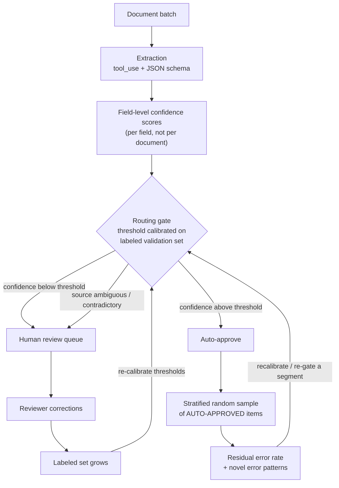

# 5.5 — Design human review workflows and confidence calibration

**Domain:** 5 — Context Management & Reliability (15%)
**Topic number:** 5.5 (topic 29 of 30 overall)
**Exam context:** structured data extraction pipelines (invoices, claims, loan packets, enrollment forms) with limited human reviewer capacity.

---

## 1. Mental model

**The load-bearing idea:** the auto-approved bucket is the one nobody looks at, so it is the one you must *sample*. Everything else in the topic follows from that.

---

## 2. Core concepts

- **Schema ≠ confidence ≠ accuracy** — the schema guarantees *shape*, confidence estimates *self-belief*, only a labeled set measures *truth*. (Carries forward from 4.3.)
- **Raw model confidence is uncalibrated** — "0.9" is a token, not a probability. It becomes usable only after mapping confidence bands to observed accuracy on a **labeled validation set**.
- **Field-level, not document-level** — one document holds an easy `invoice_number` and a hard `handwritten_total`. A document-level score averages them and routes both wrongly.
- **Aggregate accuracy masks segments** — 97% overall can be 99% on native PDFs and 74% on phone photos. The aggregate is dominated by the majority segment.
- **Segments that matter:** document *type/source* (native PDF vs scan vs photo vs handwritten) and *field* (`total` vs `vendor_name` vs `line_items[]`).
- **Stratified random sampling** — sample a fixed proportion *within each stratum* (doc type × field) so rare segments are actually measured instead of swamped.
- **Two jobs of the sample:** (a) measure the residual error rate of auto-approved output; (b) detect **novel error patterns** — new vendor template, format drift, failure modes absent from the original validation set.
- **Two independent routing triggers:** low calibrated confidence **OR** an ambiguous/contradictory *source document* — the second fires even when the model is confident, because ground truth itself is unclear.
- **Reviewer capacity is the scarce resource** — the workflow exists to *spend* it where expected error × impact is highest, not to reduce total review for its own sake.

---

## 3. Decision table

| Option | Use when | Breaks when | Why the exam favours it |
|---|---|---|---|
| **Field-level confidence + calibrated threshold routing** | Volume exceeds reviewer capacity and fields vary in difficulty | No labeled set exists to calibrate against | Only routing that targets reviewer attention at *measured* risk |
| **Segment-level accuracy validation (doc type × field) before automating** | About to reduce/remove review on a "high-confidence" bucket | Segments too small to measure — then keep them in review | Answers the "97% overall — safe to automate?" trap: **no, not until every segment is checked** |
| **Ongoing stratified random sampling of auto-approved items** | Automation is live and running unattended | Sample rate too low to detect a rare-but-costly error class | Only mechanism that sees drift and novel patterns in the un-reviewed bucket |
| **Route ambiguous/contradictory source documents to a human** | Source has two conflicting totals, an illegible field, an inconsistently filled form | Used as a dumping ground instead of fixing schema/prompt issues | Confidence can be high on a genuinely unresolvable document — a *source* problem, not a *model* problem |
| **Validation + retry loop (4.4)** | Output is malformed, fails schema, violates a stated constraint | The information was never in the document — retry cannot invent it | Retry fixes assembly; human review resolves absence/ambiguity |
| **Review 100% of output** | Pilot phase, or before any calibration data exists | Volume grows past capacity; becomes the bottleneck | Correct *starting* state — it generates the labeled set |
| **Route by document length / complexity heuristics** | — | Always | Distractor: complexity is not a measured error signal |

---

## 4. Worked scenario — invoice extraction pipeline

**Setup:** 40k invoices/month, 12 fields per invoice. Team reports **97% field-level accuracy** on a 2,000-invoice validation set and proposes auto-approving everything ≥0.85, cutting review by 80%.

- **Break the aggregate first.** By document type: native PDF 99.1%, emailed scans 96%, **phone-photo/handwritten 78%**. By field: `invoice_number` 99.8%, **`line_items[]` 88%**, `tax_amount` 91%.
- **Verdict:** reject as stated. 97% is a volume-weighted average dominated by native PDFs (~80% of volume). Uniform automation ships a ~22% error rate on the photo segment.
- **Calibrate, don't assume.** On the labeled set, check what ≥0.85 actually means *per segment* — it may be 99.4% for `invoice_number` on native PDFs but 84% for `line_items[]` on scans. Thresholds are **per segment**.
- **Automate selectively.** Auto-approve only the (doc type × field) cells that clear the target at their calibrated threshold; keep photo/handwritten and `line_items[]` in full review.
- **Keep watching.** Stratified random sample ~2% of auto-approved extractions per stratum monthly → measures residual error and catches the new vendor template that moves tax into a second column.
- **Add the source-ambiguity route.** An invoice showing two different totals (subtotal box vs stamped correction) goes to a human regardless of confidence.

---

## 5. Anti-patterns

| ❌ Anti-pattern | ✅ Correct approach | Why it's wrong |
|---|---|---|
| "97% overall, so automate the high-confidence bucket" | Validate accuracy **per document type and per field** before reducing review | The aggregate is dominated by the easy majority segment; minority segments can be catastrophic and invisible |
| Trust self-reported confidence as a probability | Calibrate confidence bands against a **labeled validation set**, then set thresholds | Uncalibrated scores are typically overconfident; "0.9" ≠ 90% correct |
| One confidence score per document | **Field-level** confidence scores | Averages an easy field with a hard one and routes both incorrectly |
| Stop measuring once items are auto-approved | **Ongoing stratified random sampling** of the auto-approved stream | The un-reviewed bucket is exactly where undetected error accumulates and drift hides |
| Sample only low-confidence / rejected items | Sample the **high-confidence auto-approved** items | Low-confidence items already get human eyes — sampling them measures nothing new |
| Simple random sample across all output | **Stratified** sample by doc type × field | Rare (risky) segments get almost no sampled items in a simple random draw |
| Review the first N of each batch, or the N lowest-confidence auto-approved items | **Random** selection **within each stratum** | Non-random selection can't estimate the bucket's error rate and structurally excludes confidently-wrong errors |
| Escalate to human based on document complexity or length | Route on **calibrated low confidence** or **ambiguous/contradictory source** | Complexity correlates with reviewer *time*, not model *error* |
| Retry when the source is illegible or self-contradictory | Route to **human review** | Retry only fixes what the model mis-assembled, never what the document never clearly contained — and a more forceful prompt can turn appropriate uncertainty into a confidently wrong answer |
| Lower the threshold so the queue fits capacity | Re-aim capacity via field-level routing; keep thresholds evidence-based | Sets the routing rule from **capacity, not risk** — accepts an unmeasured number of new errors |
| Add reviewers to keep 100% review as volume grows | Calibrate + route so scarce capacity goes to highest-risk items | Doesn't scale; the exam's framing is always *limited reviewer capacity* |

---

## 6. Exam cheat-sheet

| Trigger phrase in the question | Correct answer pattern |
|---|---|
| "97% overall accuracy — is it safe to automate?" | **No** — break accuracy down **by document type and by field** |
| "How do we detect errors in extractions no human sees?" | **Stratified random sampling** of the auto-approved bucket, ongoing |
| "New vendor format / accuracy silently drifted" | Ongoing sampling detects **novel error patterns**; a one-time or static validation set cannot |
| "Model reports high confidence but is often wrong" | Confidence is **uncalibrated** — calibrate bands against a **labeled validation set** |
| "Which extractions should a human see?" | **Low calibrated confidence** *or* **ambiguous/contradictory source document** |
| "Limited reviewer capacity — how do we prioritize?" | Route by calibrated field-level confidence; spend capacity on highest expected error |
| "Reviewers change only one field per document" | Wrong granularity → move from document-level to **field-level** confidence and routing |
| "Output was malformed / failed the schema" | That's **validation + retry** (4.4), not human review |
| "Information isn't in the document at all" | Human review / nullable field — **not** retry |
| "Sample the flagged low-confidence items to measure quality" | Distractor — those are already reviewed; sample the **auto-approved** ones |

---

# Practice questions

## Q1 — Automating on an aggregate metric

A financial services firm extracts 14 fields from loan application packets. All extractions are human-reviewed today and the review team is the throughput bottleneck. The ML lead reports **97.2%** field-level accuracy over 3,000 labeled packets, and **98.9%** accuracy for extractions with confidence ≥ 0.90 (71% of all extractions). Proposal: auto-approve everything ≥ 0.90, cutting review volume ~70%. Packet sources: lender-generated PDFs (68%), borrower-uploaded scans (24%), mobile phone photographs (8%).

**What is the most important step to take before implementing this proposal?**

- **A.** Raise the auto-approval threshold from 0.90 to 0.97 as a safety margin, then implement as proposed.
- **B.** Disaggregate the validation results by document source and by individual field, and confirm the ≥0.90 bucket meets the accuracy target within every segment.
- **C.** Add a validation-and-retry loop so any extraction failing JSON schema validation is re-run before the confidence threshold is applied.
- **D.** Increase the labeled validation set from 3,000 to 10,000 packets to tighten the confidence interval on the 98.9% figure.

**Correct answer: B**

- **B is correct** — both headline numbers are **volume-weighted averages dominated by lender PDFs (68%)**. Phone photos are 8% of volume; they could extract at 80% and move the aggregate by under 1.5 points. The same masking happens per field. Automating on an aggregate ships an unmeasured error rate into the exact segment nobody will look at again. The exam rule: **validate accuracy by document type and field segment before automating high-confidence extractions.**
- **A is wrong** — treats an **uncalibrated** score as a probability with a knowable safety margin. Without labels you cannot say what 0.97 buys; if the photo segment is systematically overconfident, a higher global threshold moves the cut point without fixing the segment problem, while sacrificing throughput on segments that were fine.
- **C is wrong** — solves a different problem from a different task statement (4.4). Schema validation catches *malformed shape*; it cannot detect a well-formed, schema-valid, confidently-reported **wrong value**, which is exactly what automation exposes here.
- **D is wrong** — more data drawn the same way reproduces the same imbalance (10,000 packets still ≈ 800 photos). **The problem is that the number is aggregated, not that it is imprecise.** Near-neighbour trap: sampling matters here, but the right move is *stratified* sampling, not a bigger undifferentiated sample.

---

## Q2 — Detecting drift in the un-reviewed bucket

An insurance claims-extraction pipeline has run for seven months. Segment-level validation was done properly at launch; above-threshold extractions auto-approve, below-threshold go to review where reviewers correct ~6%. Finance discovers that **claims from a large hospital network have posted incorrect `service_date` values for at least two months** — the network switched to a new billing form template in April. The extractions were auto-approved with high confidence, never entered the review queue, and no alarm fired.

**Which change would most directly have surfaced this problem?**

- **A.** Continuously monitor the average confidence score of auto-approved extractions and alert when it drops below the calibrated threshold for a segment.
- **B.** Track the reviewer correction rate in the human review queue over time and investigate deviation from the 6% baseline.
- **C.** Take an ongoing stratified random sample of **auto-approved** extractions, have humans label them, and monitor the measured error rate per stratum.
- **D.** Re-run the original labeled validation set through the pipeline monthly and compare accuracy against launch-time figures.

**Correct answer: C**

- **C is correct** — the only mechanism that puts human eyes back on the un-reviewed bucket. Stratifying by document source keeps the hospital network's form from being diluted into a whole-population sample. It also delivers the exam's second job for sampling: **detecting novel error patterns** — a failure mode that did not exist at launch and cannot appear in any launch-time artifact.
- **A is wrong** — the bad extractions were auto-approved **with high confidence**; the model is confidently wrong. Monitoring confidence measures self-belief, which only means something once tied to labels. (It is also arithmetically inert: by construction everything above the threshold scores above the threshold.)
- **B is wrong** — the **wrong-bucket** distractor. The review queue contains only below-threshold extractions; these claims never entered it. Correction rate says nothing about the population humans don't see.
- **D is wrong** — the strongest distractor, but a **static labeled set is frozen in time**. It contains no examples of the April template, so it reproduces launch-era accuracy forever. It is a regression check against known inputs, not a detector of novel ones.

---

## Q3 — Routing granularity and the two review triggers

A logistics company extracts 11 fields from supplier purchase orders. The model emits **one confidence score per document**; anything below 0.85 queues in full. Reviewer capacity is ~900/day; the queue runs at 1,400. A workload audit finds: (1) in ~60% of queued documents reviewers change **exactly one field** (usually `line_item_total` or `delivery_window`) and confirm the other ten; (2) another group queues repeatedly because the **source PO itself is contradictory** (handwritten correction next to a printed total; two different delivery dates on pages 1 and 3).

**Which change most effectively prioritizes the limited reviewer capacity?**

- **A.** Keep document-level confidence but lower the routing threshold from 0.85 to 0.70 so the queue fits capacity.
- **B.** Have the model emit **field-level** confidence scores, calibrate a per-field threshold against a labeled validation set, and route only the individual fields below threshold — while also routing any extraction whose source document is internally contradictory, regardless of confidence.
- **C.** Route on measurable complexity signals — page count, number of line items, scan quality score — since these correlate with the documents reviewers spend the most time on.
- **D.** On low confidence, automatically retry with a more detailed prompt and additional few-shot examples; queue for human review only if the retry is also low-confidence.

**Correct answer: B**

- **B is correct** — fixes both audit findings. The single-field finding is a **granularity** diagnosis: a document-level score averages one hard field with ten easy ones, so reviewers re-verify ten fields to fix one. Field-level routing sends the *field*. The second clause covers the independent trigger: **an ambiguous/contradictory source goes to a human even at high confidence**, because ground truth is unresolvable. Thresholds are per-field and set from a **labeled validation set**.
- **A is wrong** — sets the routing rule from **capacity, not risk**, accepting an unmeasured number of new errors with no labeled evidence about what 0.70 means. It also leaves the inefficiency untouched: every queued document still consumes review of all 11 fields to fix one.
- **C is wrong** — the proxy the exam explicitly rejects. Note the sleight of hand: these signals correlate with **how long reviewers spend**, not **how often the model is wrong**. Capacity goes to documents that look hard rather than documents likely to be wrong.
- **D is wrong** — confuses failure classes. **Retry only fixes what the model mis-assembled** (4.4). Much of the low confidence here comes from a source containing two conflicting values; no prompt detail resolves what the document never settled. Worse, a more forceful prompt can turn appropriate uncertainty into a **confidently wrong** output that clears the threshold and skips review entirely.

---

## Q4 — Designing the ongoing quality program (multiple response — select TWO)

A health insurer has moved enrollment-form extraction from 100% human review to selective automation. Segment-level validation was completed first and every segment cleared its target at its calibrated threshold. Auto-approval is live; roughly half the reviewer capacity is freed. The architect is designing the **ongoing quality program** that runs indefinitely alongside automation.

**Which TWO practices should the program include?**

- **A.** Draw a fixed-percentage random sample of auto-approved extractions **within each form-type × field stratum**, have humans label them, and track measured error rate per stratum over time.
- **B.** Send any extraction whose source form is illegible or contains conflicting values (e.g., two different dependent counts) to human review **regardless of the model's confidence score**.
- **C.** Each week, have reviewers examine the **200 auto-approved extractions with the lowest confidence scores** — those closest to the threshold — as a quality spot-check.
- **D.** Monitor month over month the **proportion of extractions scoring above the auto-approval threshold** and alert on significant shifts.

**Correct answers: A and B**

- **A is correct** — the measurement half. **Random** within stratum makes the sample an unbiased estimate of that stratum's true error rate; **stratified** guarantees low-volume form types get enough sampled items to be measurable. Tracking over time turns a one-off audit into drift and novel-pattern detection.
- **B is correct** — the routing half, and the exam's **second independent review trigger**. Confidence answers "does the model believe its reading?", not "does the document contain one answer?". A form with two different dependent counts has no correct extraction; high confidence on it is meaningless rather than reassuring.
- **C is wrong** — the subtlest distractor: it does look at the auto-approved bucket, but the selection is **deterministic and boundary-hugging, not random**. It yields no valid estimate of the bucket's error rate, and it structurally excludes the failure this topic is about — the **confidently wrong** extraction sitting at 0.97, where a new template or drifted field will land. It measures the threshold, not the bucket.
- **D is wrong** — a **label-free proxy**. It watches the model's self-belief distribution and never checks a value against ground truth. A new form layout extracted confidently but incorrectly moves accuracy without necessarily moving the score distribution.

---

## 7. Clarifications worth remembering

- **A complete program needs one routing rule and one measurement rule.** Routing decides who gets human attention; sampling checks the remainder. An answer that supplies only one of the two is incomplete.
- **Confidence monitoring is not error monitoring.** Any metric computed purely from confidence scores — average confidence, score distribution shift, proportion above threshold — has no ground truth attached and cannot detect confidently-wrong output.
- **"Sampling the auto-approved bucket" is necessary but not sufficient** — the selection must also be *random within stratum*. Lowest-confidence-N, first-N, and largest-N are all convenience selections that break the estimate.
- **Retry vs. human review is a recurring cross-topic boundary** (with 4.4): retry repairs *assembly* failures (malformed, schema-violating, constraint-ignoring); human review resolves *source* failures (absent, illegible, contradictory).
- **Thresholds are evidence, not knobs.** Both raising a threshold "for safety" and lowering it "to fit capacity" are wrong for the same reason — neither is grounded in labeled measurement.
