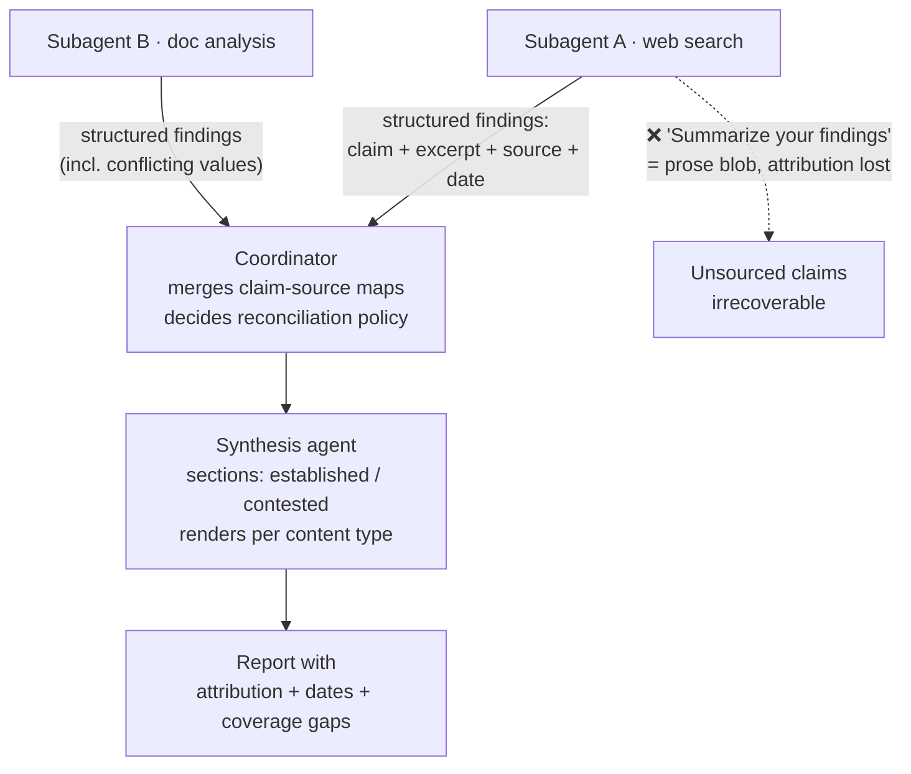

# 5.6 — Preserve information provenance and handle uncertainty in multi-source synthesis

**Domain:** 5 — Context Management & Reliability (15%)
**Topic number:** 5.6 (final task statement of the syllabus)
**Exam scope:** keeping claim → source → date mappings intact through the subagent → coordinator → synthesis compression chain, and annotating conflicts instead of resolving them silently.

---

## 1. Mental model

**Governing idea:** attribution is destroyed at the *compression* step, and once destroyed it cannot be recovered downstream. No synthesis prompt can re-attach a source the subagent already dropped. Provenance is therefore enforced **at the output contract of the agent that still holds the source**, never at the consumer.

---

## 2. Core concepts

- **Where provenance dies** — at every summarization hop. A subagent told "summarize what you found" returns prose; the claim survives, the URL/excerpt/date do not.
- **Claim-source mapping** — the atomic unit of a finding: `claim` + `evidence excerpt` + `source` (URL / document name) + `publication or collection date`. Four fields, not one string.
- **Content vs metadata separation** — the schema keeps the assertion and its provenance in separate fields. Concatenating them into one text field is not structured output.
- **Preserve and merge** — the synthesis agent *merges* claim-source maps; it does not rewrite them into narrative. Merging = grouping claims by topic while each keeps its own attribution.
- **Conflicting statistics from credible sources** — annotate both with attribution. Do not pick one, do not average, do not treat the disagreement as an error.
- **Temporal disambiguation** — many "contradictions" are two correct numbers from different dates. Without a required date field the synthesis agent cannot tell a *conflict* from a *time series*.
- **Established vs contested sections** — report structure itself carries the uncertainty signal; burying a contested figure among settled ones erases the distinction.
- **Original source characterization + methodological context** — "self-reported survey, n=200" must survive. Stripping it makes two incomparable numbers look like a factual contradiction.
- **Coverage gaps** — when a subagent fails or returns partial results (→ 5.3), the gap is annotated explicitly in the output, not silently omitted.
- **Content-type-appropriate rendering** — financial data → tables, news → prose, technical findings → structured lists. Flattening everything to one format destroys meaning.

---

## 3. Decision table

| Option | Use when | Breaks when | Why the exam favours it |
|---|---|---|---|
| **Require structured claim-source schema in each subagent's output contract** | Any multi-source research/synthesis pipeline | Never — this is the baseline | Enforces provenance at the only point where the source is still in hand |
| **Instruct the synthesis agent to "cite sources"** | Nothing, as a primary fix | Subagents already returned prose — nothing to cite | Classic distractor: fixes the wrong hop |
| **Annotate the conflict with both values + sources** | Two credible sources disagree | — | Preserves the information the reader needs to judge |
| **Coordinator picks the "more reliable" source** | Only when an explicit stated policy exists | A subagent applies it unilaterally | Reconciliation is a **coordinator** decision, never a subagent one |
| **Require publication/collection date in schema** | Any data that changes over time (stats, prices, headcounts) | — | Turns fake contradictions into a correct temporal reading |
| **Split report into "well-established" / "contested"** | Findings vary in support level | Everything is equally supported | Structure communicates confidence without prose hedging |
| **Per-content-type rendering** | Mixed financial / news / technical inputs | A uniform-format mandate is imposed | Preserves comparability (tables) and nuance (prose) |
| **Drop the lower-quality source to keep the report clean** | ❌ never | Always | Silent data loss; reader cannot audit |

---

## 4. Worked scenario — multi-agent research system

**Setup:** a coordinator spawns a web-search subagent and a document-analysis subagent to report on market size. Reports read fluently but reviewers cannot verify anything.

- **Symptom:** report states "the market is $4.2B" with no source; a reviewer finds an internal deck saying $3.1B.
- **Diagnosis:** the doc-analysis subagent found **both** figures, judged $4.2B "more current," and returned only that one. Attribution and the discarded value died inside the subagent — the coordinator never learned a conflict existed.
- **Fix 1 (output contract):** subagent schema requires an array of findings, each `{claim, excerpt, source_document, publication_date}`; instruction: **return conflicting values, do not reconcile.**
- **Fix 2 (coordinator):** now sees `$4.2B (Analyst Report, 2025-03)` and `$3.1B (Internal Deck, 2023-11)` — dates reveal a **time difference, not a contradiction**.
- **Fix 3 (synthesis):** market-size figures render as a **table** with a date column; qualitative outlook renders as prose; single-sourced items land under "Contested / limited support"; a line notes the web subagent timed out on EMEA (**coverage gap**).

---

## 5. Anti-patterns

| ❌ Anti-pattern | ✅ Instead | Why it's wrong |
|---|---|---|
| Subagent prompt: "Summarize your findings" | "Return findings as structured objects: claim, excerpt, source, date" | Prose is the compression step where attribution is irreversibly lost |
| Subagent picks the "best" of two conflicting values | Subagent returns both, annotated; coordinator reconciles | Reconciliation policy lives with the agent that sees all sources |
| Averaging conflicting statistics | Present both with attribution | Invents a number no source supports |
| Adding "always cite your sources" to the synthesis prompt | Fix the subagent schema | The synthesis agent cannot cite what it never received |
| Dates optional in the schema | Date required per finding | Without dates, stale-vs-current reads as contradiction |
| Rendering everything as bullet lists for consistency | Tables for financials, prose for news, lists for technical | Uniform formatting destroys comparability and nuance |
| Dropping a failed subagent's topic silently | Annotate the coverage gap in the report | Reader infers "nothing found" from "nothing looked" |
| Stripping "n=200 self-reported survey" as noise | Preserve methodological context with the claim | Two incomparable methods look like a factual conflict |
| One long undifferentiated "Findings" section | "Well-established" / "Contested" sections | Structure is the confidence signal the exam wants |
| Hedging words ("approximately", "reportedly") in place of attribution | Name both values and both sources | Signals doubt without saying what the disagreement is |

---

## 6. Exam cheat-sheet

| Trigger phrase in the question | Correct answer pattern |
|---|---|
| "Final report contains claims that can't be traced to a source" | Require **structured claim-source mappings in the subagent output schema** — not a synthesis-prompt instruction |
| "Two credible sources report different statistics" | Preserve **both, with attribution**; do not select, average, or discard |
| "Subagent chose the value it judged more reliable" | Wrong layer — subagent returns both; **coordinator decides reconciliation** |
| "Figures appear contradictory" / "data seems inconsistent" | Suspect **missing publication/collection dates**; require them in the schema |
| "Report treats speculative and well-supported findings identically" | Restructure into **explicit established vs contested sections** |
| "Everything was converted to a uniform format" | Render **per content type** — tables / prose / lists |
| "A subagent failed; report doesn't mention it" | Annotate **coverage gaps** in the output (ties to 5.3 error propagation) |
| "Attribution is lost after summarization" | The fix is **upstream, at the compressing agent's output contract** |
| "Add a citation instruction to the synthesizer" (as an option) | Distractor — cannot recover already-discarded provenance |

---

## 7. Practice questions

### Question 1 — where attribution is lost

**Scenario:** A coordinator spawns three research subagents (web search, internal document analysis, financial filings), then passes their outputs to a fourth **synthesis subagent** that writes the client report.

Each research subagent's prompt ends with: *"Summarize the key findings from your sources in a concise paragraph."* The synthesis subagent's prompt says: *"Combine the findings into a single report. Always cite your sources."*

Clients complain that reports contain confident factual claims — market sizes, growth rates, competitor headcounts — that cannot be traced to any document. Spot checks confirm the underlying sources *do* contain the numbers, correctly.

Which change would most effectively fix the traceability problem?

- **A.** Strengthen the synthesis subagent's prompt with explicit citation formatting rules and a few-shot example showing an ideal cited paragraph.
- **B.** Change each research subagent's output contract to a structured schema where every finding is an object containing the claim, a verbatim evidence excerpt, the source URL or document name, and the publication date.
- **C.** Have the coordinator re-run each research subagent after synthesis to locate and attach the source for every claim in the draft report.
- **D.** Give the synthesis subagent direct read access to all original source documents so it can look up and attach citations itself while writing.

**Correct answer: B**

**Why B is right**
- "Summarize in a concise paragraph" **is** the destructive step — the claim survives, the source/excerpt/date do not.
- The research subagent is the last agent holding the source, so it is the only one that can attach provenance without re-fetching.
- Structured ≠ formatted prose: separate `claim` / `excerpt` / `source` / `date` fields keep content and metadata distinct so downstream merging cannot collapse them.
- The date field prevents the next failure mode (temporal differences read as contradictions) for free.

**Why the others are wrong**
- **A** — fixes the **wrong hop**. The synthesizer received unsourced paragraphs; no prompt, formatting rule, or few-shot example can cite information it never received. Few-shot shapes *form*, not *available data* (4.2). This is the most common distractor on this task statement.
- **C** — retro-attribution is reverse-engineering: a second run may surface a *different* document containing a similar number, producing citations that look valid but are not the actual provenance. Doubles cost and latency to repair what a schema prevents for free.
- **D** — pushes the full corpus into one context, defeating the isolation that justified spawning subagents (1.2), and makes the synthesizer re-derive attribution rather than preserve it. The synthesis agent's job is to **merge existing claim-source maps**, not rediscover them.

---

### Question 2 — who is allowed to reconcile

**Scenario:** A document-analysis subagent reviewing filings finds two figures for the same competitor's annual revenue: the audited 10-K says **$820M**; a well-regarded analyst report says **$910M**. Both sources are credible. The subagent's instructions say: *"Analyze the documents and report the competitor's revenue."*

The subagent reports **$820M**, reasoning that audited filings outrank analyst estimates. The coordinator passes this to synthesis and the final report states $820M. A reviewer flags this as a process failure — **not** because $820M is the wrong number.

What is the process failure, and what is the correct fix?

- **A.** The subagent used an outdated heuristic; instruct subagents to always prefer the most recently published source rather than the most authoritative one.
- **B.** The subagent performed reconciliation that belongs to the coordinator; require the subagent to return both values with source attribution and let the coordinator apply the reconciliation policy.
- **C.** The synthesis agent failed to flag the discrepancy; have it cross-check every numeric claim against all source documents before writing.
- **D.** The report presented a contested figure without hedging; instruct the synthesis agent to describe uncertain figures as "approximately" or "reportedly."

**Correct answer: B**

**Why B is right**
- The failure is **positional, not factual** — $820M may be the better number; the defect is that a subagent made a discardable-information decision unilaterally.
- The loss is irreversible: once the subagent returns one value, the coordinator cannot know a conflict existed.
- Correct contract: *"return conflicting values, explicitly annotated with source — do not reconcile."*
- The coordinator sees all subagents' outputs and any stated reconciliation policy, so it alone has standing to decide (or to pass the conflict through annotated).

**Why the others are wrong**
- **A** — still lets the subagent silently discard a value; it only changes *which* credible figure disappears. Substituting one unilateral rule for another does not fix unilateral filtering.
- **C** — re-derivation instead of preservation, and it requires loading all raw sources into the synthesizer, collapsing context isolation. Downstream verification cannot restore what was dropped upstream.
- **D** — vague-confidence prose is the anti-pattern this task statement targets. Hedging signals doubt without conveying **what** the disagreement is, who said what, or how large the gap is. The exam wants annotated conflict with attribution, never softened wording.

---

### Question 3 — temporal data

**Scenario:** Subagents return structured findings with `claim`, `excerpt`, and `source` fields. Dates are not in the schema. The synthesis agent writes:

> *"Sources conflict sharply on headcount. LinkedIn data indicates approximately 4,000 employees, while the company's own annual report states 2,600. This discrepancy suggests one of the sources may be unreliable, and the figure should be treated with low confidence."*

Investigation shows both sources were accurate: the LinkedIn scrape was collected in **2025**; the annual report cited was the **2022** filing. The company had genuinely grown.

What is the most effective fix to prevent this class of error?

- **A.** Instruct the synthesis agent to resolve conflicts by preferring first-party sources (company filings) over third-party aggregators.
- **B.** Add a required `publication_or_collection_date` field to the subagent finding schema so downstream agents can distinguish temporal differences from genuine contradictions.
- **C.** Instruct subagents to only return findings from sources published within the last 12 months, discarding older documents.
- **D.** Add a "Contested Findings" section to the report template so conflicting figures are grouped separately from well-established ones.

**Correct answer: B**

**Why B is right**
- The root cause is a **missing field**, not bad judgment — the synthesis agent reasoned correctly given what it had.
- With dates, "4,000 (2025) vs 2,600 (2022)" reads as a **growth trajectory**, not a conflict; no confidence penalty is warranted.
- Making the date **required** in the schema means no subagent can omit it at any hop.
- Prevents the pipeline from labelling accurate sources "unreliable" and depressing confidence on sound data.

**Why the others are wrong**
- **A** — the first-party heuristic would pick the **2022** filing over the current 2025 figure, actively selecting the stale number. Authority rules cannot substitute for temporal information.
- **C** — destroys legitimate historical and trend data, and still does not date what remains; two sources inside the same 12-month window can differ temporally. Filtering the corpus ≠ capturing when data was collected.
- **D** — right technique, wrong problem. There is no real conflict here, so this would file two correct, compatible figures under "contested," entrenching the misreading. Structure communicates uncertainty; it does not produce the data needed to detect it.

---

### Question 4 — content-type-appropriate rendering

**Scenario:** A financial-research agent produces a quarterly briefing synthesizing three input types: quarterly revenue/margin/cash-flow figures for 8 competitors (filings); recent M&A and regulatory news; and engineering-blog analyses of competitors' platform architectures.

To keep the output "clean and consistent," the synthesis prompt says: *"Render all findings as a uniform bulleted list, one bullet per finding, with the source in parentheses at the end of each bullet."*

Analysts report the briefing is hard to use: margins cannot be compared at a glance, news items read as disconnected fragments that lose causal context, and architecture analyses are flattened into claims that omit the reasoning.

What is the most effective change?

- **A.** Increase the allowed length of each bullet and require a one-sentence rationale in every bullet.
- **B.** Split the briefing into three separate reports — one per source type — each still a uniform bulleted list.
- **C.** Instruct the synthesis agent to render each content type in the format appropriate to it: financial data as tables, news as prose, technical findings as structured lists.
- **D.** Move source attributions from inline parentheses into a numbered footnote section, freeing space for substantive content.

**Correct answer: C**

**Why C is right**

| Content type | Correct rendering | What the format preserves |
|---|---|---|
| Financial figures across 8 competitors | Table | Cross-entity comparability — aligned columns; bullets destroy this |
| M&A / regulatory news | Prose | Causal and narrative context |
| Architecture analyses | Structured lists | Component/tradeoff decomposition with reasoning attached |

- The defect is a **format-uniformity mandate**, not insufficient space or misplaced citations.
- Format is not cosmetic; it carries meaning that flattening deletes.

**Why the others are wrong**
- **A** — treats a **structural** problem as a **length** problem. A longer bullet still cannot align 8 competitors' margins into comparable columns, and a rationale sentence bolted onto a fragment does not restore narrative causality.
- **B** — changes packaging, not rendering. Every original complaint survives inside each split report, and cross-type synthesis (linking a regulatory item to a margin swing) is lost.
- **D** — attribution placement is a formatting preference and was not the reported problem; provenance was already inline. Moving sources away from claims weakens traceability, the opposite of the goal.

---

### Question 5 — coverage gaps under partial results (select TWO)

**Scenario:** A coordinator spawns four research subagents for North America, EMEA, APAC, and LATAM. All return structured findings with claim, excerpt, source, and date.

The **EMEA** subagent times out after retrieving only two of eight planned sources. It returns a structured error containing failure type, queries attempted, and partial findings. The coordinator proceeds with synthesis using three complete regions plus EMEA's partial results. EMEA's section is thinner but reads as complete, and conclusions treat all four regions as equally supported.

Which combination best addresses the reliability problem? (Select TWO.)

- **A.** Require the synthesis agent to annotate the report with an explicit coverage gap statement identifying EMEA as partially researched, including which sources were not retrieved.
- **B.** Configure the coordinator to abort the entire synthesis when any subagent fails, returning an error to the user rather than a partial report.
- **C.** Place EMEA's under-supported conclusions in the report's "contested / limited support" section rather than alongside the well-established findings from complete regions.
- **D.** Have the coordinator retry the EMEA subagent with the same query set until it completes, so all four regions have equal coverage before synthesis.

**Correct answers: A and C**

**Why A is right**
- Error propagation already worked (5.3): structured failure context returned, coordinator correctly proceeded with partial results.
- The break is at the **output boundary** — a thin EMEA section that reads complete lets the reader infer "little was found" when the truth is "little was looked at."
- The gap must be **explicit and specific** (which region, which sources missing). A generic "some data may be incomplete" does not let the reader calibrate.

**Why C is right**
- Partial sourcing means EMEA's conclusions carry less evidentiary support than the other regions.
- Same-section placement makes the report structure assert a confidence level the evidence does not back.
- The established/contested split encodes that difference structurally rather than through hedging adverbs.

**A and C are complementary:** A explains *why* coverage is uneven (process fact); C prevents uneven coverage from being read as uniform confidence (presentation fact). Either alone leaves half the defect.

**Why the others are wrong**
- **B** — discards three complete regions plus two valid EMEA sources to punish one partial failure. Graceful degradation with annotation is the established pattern (5.3): proceed with partial results and disclose. It also makes the system brittle — any transient timeout zeroes the run.
- **D** — the same queries that just timed out, with no changed condition: an unbounded retry loop with no reason to expect a different outcome (retry fixes what was mis-assembled, not what the environment would not yield — 4.4). Latency becomes unbounded, and there is still no plan for the case where EMEA cannot complete.

---

## 8. Clarifications worth remembering

- **The layer question is the whole topic.** Almost every 5.6 item resolves to *which agent's output contract do you change* — the producer that holds the source, not the consumer downstream.
- **Correct value, wrong process.** A subagent picking the objectively better figure is still a violation; the exam grades the decision's *location*, not its outcome.
- **Hedging is never the answer.** "Approximately", "reportedly", "low confidence" are distractor language. Attribution and structure carry uncertainty; adverbs do not.
- **Check whether the conflict is real before structuring it.** Missing dates manufacture fake contradictions; the "contested section" mechanism is right only once a genuine conflict is established.
- **Uniformity is a defect signal.** When a scenario brags about "consistent formatting," that phrase marks the bug.
- **Cross-links:** 5.3 (error propagation → coverage gaps), 1.2/1.3 (subagents return strings, so the output contract is the only provenance channel), 4.3 (schemas guarantee shape, not truth), 4.4 (retry cannot recover absent information).
